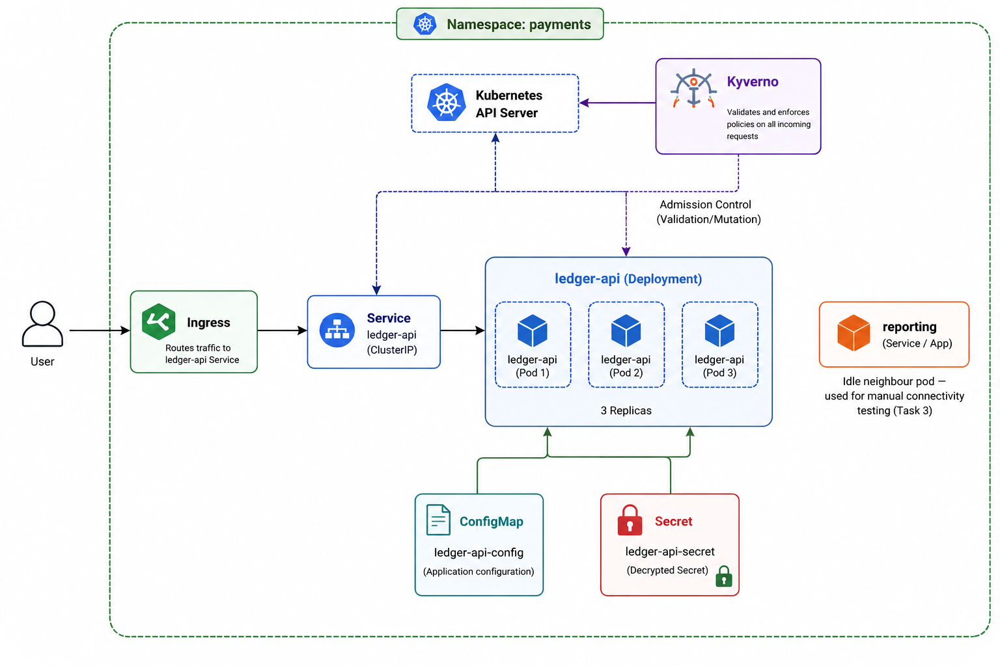

# Workload Hardening - Task 1

This folder contains the Kubernetes deployment manifests for the `ledger-api` service, hardened to meet strict security standards. 

When I took over the original setup, it had plaintext credentials committed to the git repo, containers running as root with access to the entire host file system, and no guardrails. Here is how I locked it down.

---

## What was deployed

I deployed the `ledger-api` service along with a second service called `reporting`. 

A second service (a "neighbour") was necessary so I could verify network segregation and role-based access control later. Both services are configured with deployments, cluster services, config maps, and an ingress controller routing to let traffic in.

---

## Hardening choices

### 1. Pod and Container Security
I configured the containers to run as non-root (using user ID `10001` or `1001`) and dropped all Linux kernel capabilities. 

If you do not do this, an attacker who compromises the container process could gain root privileges on the underlying host node. I also marked the root file system as read-only. This stops attackers from downloading malicious binaries or modifying system files if they find a remote code execution vulnerability.

### 2. Probes and Limits
I added CPU and memory limits. Without limits, a rogue container can hog all the host CPU or memory, causing a Denial of Service (DoS) for other containers on the same node. 

I also added HTTP liveness and readiness health checks pointing to `/health`. If the app crashes or hangs, Kubernetes will detect it via the liveness probe and restart the container automatically.

### 3. ServiceAccount and Least-Privilege RBAC
I stopped using the `default` service account. The main risk with the default service account is that it gets automatically mounted into every pod in the namespace. If anyone (like a future teammate) attaches an RBAC permission rule to the default service account later, even by accident, every pod sharing that default account instantly inherits those permissions. This makes it a shared and highly vulnerable attack surface.

I created a dedicated `ledger-api` service account. I also attached a completely empty `Role` and `RoleBinding` to it since this specific web service does not need to talk to the Kubernetes API server at all.

### 4. Secrets Management with Sealed Secrets
Leaving Stripe keys and database passwords in plain text in git commits is a huge risk because anyone with access to the repository can steal them. 

Instead of just deleting the plaintext fields, I used Sealed Secrets. I created a standard Kubernetes Secret locally, encrypted it using the cluster's Sealed Secrets controller certificate, and committed only the encrypted YAML (`deploy/secrets.yaml`). Only the controller running inside the cluster holds the private key to decrypt it back into a standard Secret at runtime.

### 5. Kyverno Admission Guardrails
I set up Kyverno policies in the cluster to act as an automated gatekeeper. Even if a developer accidentally commits an insecure deployment manifest in the future, Kyverno will intercept the deployment request at the API level and reject it. These rules explicitly block containers running as root and reject images tagged with `:latest` (since latest tags can introduce untested dependencies unexpectedly).

---

## Sequencing decision: Image signatures

I did not activate the "reject unsigned images" Kyverno policy yet. Because we have not built the automated build and image signing pipeline yet (that is the scope of Task 2), enabling it now would block all local deployments. I will add the signature verification rule once the signing pipeline is ready in the next task.

---

## Completed Bonuses

I also implemented three bonus security controls:
1. **Persona-based RBAC**: I created three separate Roles and RoleBindings in `deploy/bonus-persona-rbac.yaml` for a Developer (read-only), Operator (read-only plus deployment restarts/scaling), and Admin (full namespace control). They are ready to be bound to users.
2. **Pod Security Standards (Restricted)**: I labeled the `payments` namespace to enforce the built-in Kubernetes `restricted` security profile. I verified this works by deleting running pods and letting them recreate; they spun up successfully without any policy violation warnings.
3. **Guardrail verification**: I created an insecure deployment config using the `:latest` tag and root execution, attempted to deploy it, and captured the Kyverno policy rejection messages.

---

## Verification Evidence

All actual command outputs, logs, event traces, and runtime configuration details are documented in [EVIDENCE.md](./EVIDENCE.md) in this folder.
